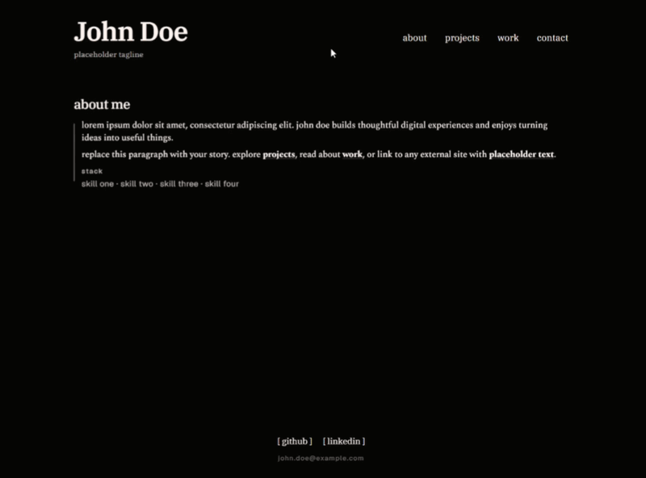

# Unfolio

A minimal, customizable portfolio built with Next.js. Edit one file to make it
your own, then deploy the finished site anywhere that supports Next.js.

All personal content lives in [`site.ts`](./site.ts). The site has no database,
login, CMS, or external content API.

## preview

Here is a walkthrough of the mock site:



## features

- content-driven about, projects, work, and contact pages
- inline Markdown-style links inside editable descriptions
- project detail modals with optional benchmarks and technology lists
- configurable colors, typography, spacing, motion, and local-time display
- responsive layout with no additional UI dependencies

## requirements

- Node.js 20.9 or newer
- npm

## quick start

```bash
git clone <your-repository-url>
cd <your-repository-directory>
npm install
npm run dev
```

Open [http://localhost:3000](http://localhost:3000) in your browser.

## customize

1. Open [`site.ts`](./site.ts).
2. Replace the John Doe placeholder content with your own information.
3. Save the file and refresh the development server.

For a complete field-by-field guide, read the guide on
[editing site.ts](./docs/editing-site.md).

The browser tab currently uses the default starter icon from
[`app/favicon.ico`](./app/favicon.ico). Replace that file with your own
favicon to personalize it.

Descriptions support links written in this format:

```text
read my [projects](/projects) or visit [my website](https://example.com).
```

Internal links use paths such as `/projects`. External links use complete
`https://` URLs and open in a new tab.

## scripts

- `npm run dev` — start the local development server
- `npm run build` — create a production build
- `npm run start` — serve the production build
- `npm run lint` — run ESLint


## project structure

```text
app/             page routes and global styles
components/      reusable interface components
docs/             customization documentation
public/           static assets
site.ts          all editable content and visual settings
```

## license

This project is available under the [MIT License](./LICENSE).
